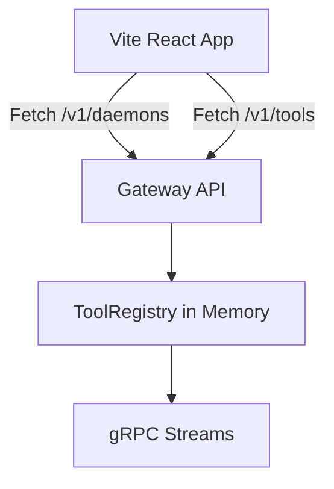

# MCP Gateway Hub 前端技术架构

## 1. 技术栈
- **框架**: React 18 + Vite (TypeScript)
- **UI 组件库**: Tailwind CSS + shadcn/ui
- **图标**: Lucide React
- **数据请求**: Fetch API (原生) 或 Axios
- **状态管理**: React Context / Hooks

## 2. 系统架构



## 3. 目录结构设计
```text
frontend/
├── src/
│   ├── components/
│   │   ├── ui/         # shadcn components
│   │   ├── layout/     # Sidebar, Header
│   │   └── features/   # DaemonsList, ToolsList
│   ├── lib/            # utils (cn)
│   ├── hooks/          # 自定义请求 Hooks (useDaemons, useTools)
│   ├── pages/          # Dashboard
│   ├── App.tsx
│   └── main.tsx
├── tailwind.config.js
├── vite.config.ts
└── package.json
```

## 4. 核心组件设计
- **Dashboard Layout**: 包含左侧侧边栏（导航）和顶部状态栏。
- **Daemons View**: 卡片网格（Grid）布局，展示每个 Daemon 的 ID、状态徽章（在线）、工具数量。
- **Tools View**: 具有搜索过滤功能的数据表格（Data Table）或折叠面板（Accordion），展示 `tool_name`，归属 `daemon_id`，以及展开查看 `inputSchema`。

## 5. 开发步骤
1. 使用 Vite 初始化 React TS 项目。
2. 配置 Tailwind CSS 和 shadcn/ui。
3. 构建 API 客户端代码。
4. 搭建主框架 Layout 和主题（Dark mode）。
5. 实现 Daemon 和 Tool 的业务组件。
6. 测试并连接本地 8080 端口。
